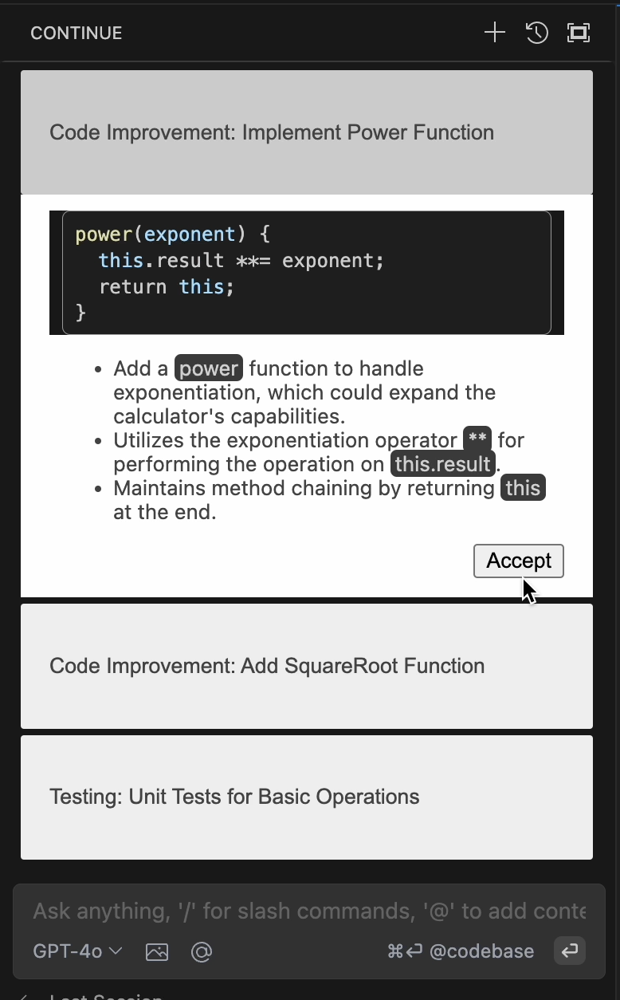
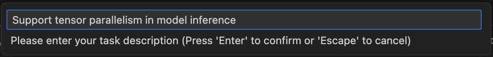
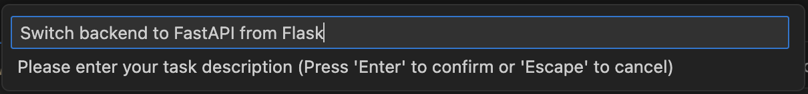
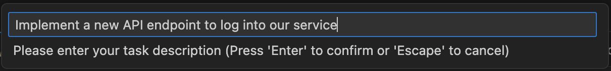

# CodingGenie

Implementation of [CodingGenie: A Proactive LLM-Powered Programming Assistant]

## Overview

CodingGenie is an open-source implementation of a proactive assistant integrated into the chat window of Continue, a VSCode coding LLM extension. Proactive suggestions are chat-based suggestions which are suggested autonomously without user prompting, triggered after code changes or chat messages. CodingGenie suggests chat completions based upon several factors, including the code context, optional task description, enabled suggestion types, and previous conversation history. 

    

    UI and components of prompting. (A) is a proactive suggestion, (B) is the accept button, (C) is the normal chat interface, and (D) is the normal editor interface.

  

    System design

## Acknowledgements
### Continue
We build CodingGenie off of a fork of Continue, here is their [main repo](https://github.com/continuedev/continue) and [website](https://www.continue.dev/). Our fork is not guaranteed to be the most up to date, so please refer to codinggenie/README_CONTINUE.md for the correct Continue README.

## Getting Started

CodingGenie requires building the package for your target architecture, with minimal changes to the installation instructions of Continue. Currently, this extension is only compatible with VSCode.

### VS Code
1. Install Node.js version 20.11.0 (LTS) or higher.
2. Clone our repo 
3. Open the codinggenie folder located in the cloned repo in VSCode.
4. Open the VS Code command pallet (`cmd/ctrl+shift+p`) and select `Tasks: Run Task` and then select `install-all-dependencies`
5. Find the newly generated file, `extensions/vscode/build/continue-{VERSION}.vsix`. Then, navigate to the Extensions icon in VSCode, click on the ... icon in the top right of the opened tab, and select "Install from VSIX". Select the newly generated file.

## Functionality and Commands

### Triggering Proactive Suggestions

Proactive suggestions may be triggered in multiple ways. With the Continue tab open, either
1. Make a code change
2. Ask a question in code chat
3. Manually request proactive suggestions by (`cmd/ctrl+shift+p`) and search for and select `Continue: Request proactive suggestions`

### Interacting with Proactive Suggestions

Proactive suggestions come in groups of three, and contain a tag and short description which summarize the purpose of the suggestion, as well as any code and explanation upon expanding the suggestion. These suggestions may be accepted, and doing so will place them into the conversation history. The suggestion will appear as a user message sending the tag and short description, and the chat assistant sending the code and explanation. Follow-up questions may be asked on accepted suggestions. Please check out our [website](https://sebzhao.github.io/CodingGenie/) for a full demonstration. 

Here is a sample of what a set of proactive suggestions may look like.

  

### Configuring Task Description

Configure task description to get suggestions directed towards a specific goal. 
1. (`cmd/ctrl+shift+p`) and search for and select `Continue: Configure Task Description`. 
2. Enter task description and press enter.

Here are some example task descriptions. 

  

  

  

### Configuring Suggestion Types

Configure suggestion types shown. 
1. (`cmd/ctrl+shift+p`) and search for and select `Continue: Configure Proactive Config`
2. Select/unselect suggestion types to enable/disable. By default all suggestions are shown.
3. Select OK.

Here are the possible suggestion types.

  

## Citation
(TODO)

## Contribution
We welcome contributions from the community, feel free to submit a PR or open an issue.

## License
This code is released under the MIT license.