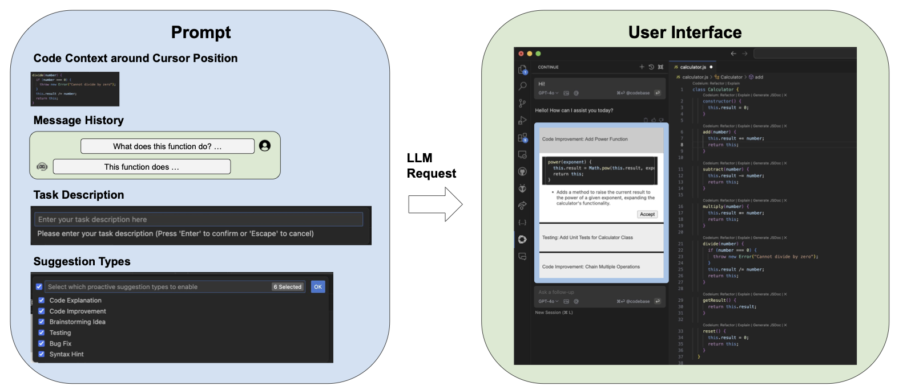
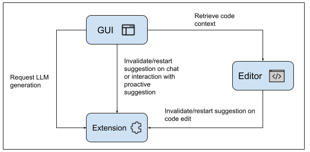

# CodingGenie

## Overview

CodingGenie is an open-source implementation of a proactive assistant integrated into the chat window of Continue, a VSCode coding LLM extension. Proactive suggestions are chat-based suggestions which are suggested autonomously without user prompting, triggered after code changes or chat messages. CodingGenie suggests chat completions based upon several factors, including the code context, optional task description, enabled suggestion types, and previous conversation history. 

 

    

    UI and Components of Prompting

 

  

    System Design

## Presentation
<iframe width="560" height="315" src="https://www.youtube.com/embed/z2hQdw54mNI?si=ERRsmYb5bL_pOfBD" title="YouTube video player" frameborder="0" allow="accelerometer; autoplay; clipboard-write; encrypted-media; gyroscope; picture-in-picture; web-share" referrerpolicy="strict-origin-when-cross-origin" allowfullscreen></iframe>

## How to use CodingGenie
Head to our [github](https://github.com/sebzhao/CodingGenie) and follow the installation instructions in the README.

## Demos
**Personal project:**
<iframe width="560" height="315" src="https://www.youtube.com/embed/CE86imxH8Gk?si=zN5lItVcY4Ahl5r9" title="YouTube video player" frameborder="0" allow="accelerometer; autoplay; clipboard-write; encrypted-media; gyroscope; picture-in-picture; web-share" referrerpolicy="strict-origin-when-cross-origin" allowfullscreen></iframe>

**Industry ticket with task description:**
<iframe width="560" height="315" src="https://www.youtube.com/embed/-7rxSFqVK3Q?si=V3zPEONERC1k03b-" title="YouTube video player" frameborder="0" allow="accelerometer; autoplay; clipboard-write; encrypted-media; gyroscope; picture-in-picture; web-share" referrerpolicy="strict-origin-when-cross-origin" allowfullscreen></iframe>

**School assignment with suggestion customization:**
<iframe width="560" height="315" src="https://www.youtube.com/embed/IcLN5YvQfsw?si=vwEnj4Va_hSWPLqN" title="YouTube video player" frameborder="0" allow="accelerometer; autoplay; clipboard-write; encrypted-media; gyroscope; picture-in-picture; web-share" referrerpolicy="strict-origin-when-cross-origin" allowfullscreen></iframe>

## Experimental Results
We evaluate the number of relevant suggestions out of the three shown for each proactive setting across 3 different use cases, shown above: We find that customizing suggestions through task descriptions or suggestion types can increase the number of relevant suggestions.

|                         | Personal Project | Industry Ticket | School Assignment |
|-------------------------|------------|------------|------------|
| Proactive Suggestion    | 3/3        | 0/3        | 1/3        |
| +Task Description       | 3/3        | 3/3        | 1/3        |
| +Type Customization     | 3/3        | 0/3        | 3/3        |

We provide some further details on our experimental setup. We specify the task description and type customization to be best aligned towards the goal in each scenario shown above.

### Personal Project 
Any suggestion which attempted to implement a new feature was scored as relevant. The task description used was “Implement new functionality that might be good to include”, and the type customization used included "Code Improvement, Brainstorming Ideas, and Testing”. 

### Industry Ticket 
Any suggestion which attempted to modify the code to support multi-GPU inference or otherwise accelerate inference was scored as relevant. The task description used was "Optimize inference by supporting multi GPU inference", and the type customization used included "Code Improvement and Brainstorming".

### School Assignment
Any suggestion which attempted to provide scaffolding instead of directly giving away answers were scored as relevant. The task description used was "Provide scaffolding to help understand how to complete the project", and the type customization used included "Brainstorming Ideas, Testing, Bug Fix, and Syntax Hint". 

## Citation
We will soon update this section with how to cite us, thank you!

## License
This code is released under the MIT license.

[repo]: https://github.com/sebzhao/CodingGenie